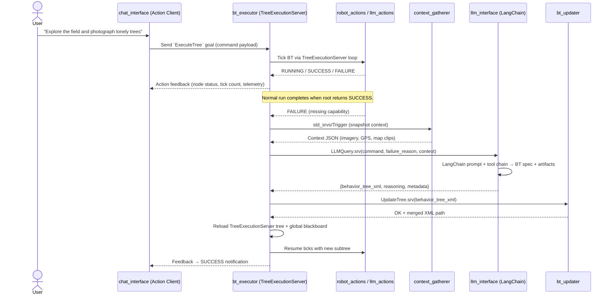

# BehaviorTree.ROS2 + LangChain Architecture

## Overview

`generalist_bt_gen` combines ROS 2 Jazzy, BehaviorTree.CPP, BehaviorTree.ROS2, and LangChain to let a field robot execute natural-language tasks and expand its own behavior tree when it detects capability gaps. The executor now subclasses `behaviortree_ros2::TreeExecutionServer`, so BT runs are exposed as ROS 2 Actions with built-in logging, preemption, and plugin management. When the tree cannot complete a command, LangChain orchestrates LLM reasoning, tool calls, and MCP servers to synthesize new BT subtrees that are merged into the running executor without restarting the rest of the stack.

## Technology Stack

| Layer | Tooling | Notes |
| --- | --- | --- |
| Behavior tree runtime | BehaviorTree.CPP 4.x | Core BT engine and plugin API. |
| ROS integration | BehaviorTree.ROS2 (`TreeExecutionServer`) | Wraps BT execution inside an `rclcpp_action::Server`, handles XML/plugin discovery, Groot2 logging, and action feedback. |
| Robotics middleware | ROS 2 Jazzy | Provides rclcpp/rclpy nodes, services, actions, Nav2 + sensor interfaces. |
| LLM orchestration | LangChain (Python) | Supplies prompt templates, multi-provider LLM clients (OpenAI/Gemini/Claude), tool-calling, and MCP server integration for structured plans and BT specs. |
| Cloud LLMs | OpenAI, Google Gemini, Anthropic Claude | Configurable via LangChain; selected per prompt config. |

## Package Responsibilities

| Package | Purpose | Key Dependencies |
| --- | --- | --- |
| `bt_executor` | Extends `TreeExecutionServer` with custom hooks: registers BT plugins, seeds the global blackboard, listens for failure states, and drives the LLM regeneration loop. Publishes action feedback/metrics. | `behaviortree_cpp`, `behaviortree_ros2`, `rclcpp`, `std_srvs`, `yaml-cpp`, `nlohmann_json`. |
| `robot_actions` *(replacing `bt_actions`)* | ROS-native BT plugins for locomotion, manipulation, and sensing (Nav2 goals, camera triggers, etc.). | `rclcpp`, `behaviortree_cpp`, `nav2_msgs`, `sensor_msgs`, `geometry_msgs`, `action_msgs`. |
| `llm_actions` | BT nodes that gate behavior based on LLM output, update the blackboard, and bridge to the LangChain service (e.g., Thinking node, plan validator). | `rclcpp`, `behaviortree_cpp`, `nlohmann_json`, `llm_interface`. |
| `context_gatherer` | Aggregates camera frames, GPS, point clouds, and semantic context into the format expected by LangChain tools/MPL servers. | `rclcpp`, `sensor_msgs`, `nav_msgs`, `geographic_msgs`, `image_transport`, `cv_bridge`, `nlohmann_json`. |
| `llm_interface` | Python ROS node exposing `LLMQuery.srv`. Uses LangChain PromptTemplates, tool chains, and MCP-backed retrievers to generate BT specs + artifacts. | `rclpy`, `langchain`, `openai`, `google-generativeai`, `anthropic`, `requests`, `python3-yaml`. |
| `bt_updater` | Applies LangChain-generated XML patches to the authoritative BT tree, validates them with TinyXML2, and requests the executor to reload. | `rclcpp`, `behaviortree_cpp`, `tinyxml2`, `yaml-cpp`. |
| `chat_interface` | CLI/web UI for human commands; now capable of acting as an Action client to the executor (start/cancel missions, show progress). | `rclpy`, `FastAPI`/`Flask`, `websockets`, `action_msgs`. |

Optional packages such as `bt_visualizer` can subscribe to the executor action feedback or Groot2 stream for live dashboards.

## Runtime Flow

## Failure & Regeneration Lifecycle

1. **Detection** – `TreeExecutionServer::onLoopAfterTick` inspects every tick result. When the BT returns `FAILURE` or a guard node signals `NEEDS_EXTENSION`, the hook stops the action goal and enters regeneration mode.
2. **Context capture** – A dedicated `context_gatherer` tool is invoked via ROS service. Output is saved to disk/cloud storage and passed as structured JSON to LangChain.
3. **LangChain workflow** – `llm_interface` loads the configured PromptTemplate, selects a model (OpenAI/Gemini/Claude) and orchestrates tool calls (e.g., map query, knowledge base). The final response contains a validated BT spec plus supporting artifacts (new plugin hints, metadata).
4. **Tree update** – `bt_updater` merges the generated subtree into the canonical XML, leveraging TinyXML2 + schema validation. Conflicts are resolved via predefined anchors (e.g., `LearningSelector` insertion point).
5. **Executor reload** – `bt_executor` calls `TreeExecutionServer::createTreeFromText` with the merged XML, reattaches loggers, repopulates the blackboard, and restarts the Action goal so ticks continue seamlessly.

## Configuration & Observability

- **Parameters**: BehaviorTree.ROS2 parameters set plugin folders, XML search paths, executor QoS, and action names. Additional YAML files define LangChain prompt configs, tool endpoints, and MCP server credentials.
- **Secrets**: Cloud API keys (OpenAI, Gemini, Claude) live in `llm_interface` environment files; the setup script provisions them via `.cloud_secrets/openai.env`.
- **Monitoring**: Groot2 is enabled by default via `TreeExecutionServer`. `bt_executor` can attach extra publishers that mirror action feedback to `diagnostics` topics for Prometheus dashboards. LangChain reasoning traces are logged to JSONL for auditing.
- **Testing hooks**: BehaviorTree.ROS2’s headless tools allow dry-run execution of XML trees. LangChain pipelines are unit-tested with mock LLMs and tool call fixtures.

This revised architecture keeps the modular ROS 2 package layout while delegating BT execution concerns to BehaviorTree.ROS2 and adopting LangChain for multi-provider LLM orchestration, aligning the codebase with the updated tech stack in `README.md`.
