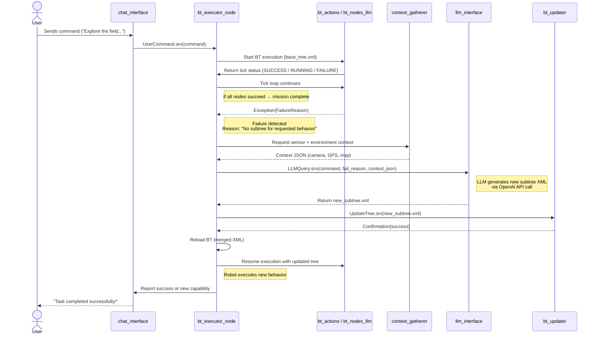

# LLM-Augmented Behavior Tree Executor — System Architecture

## Overview

This system enables an **autonomous robot** to execute user commands through a **Behavior Tree (BT)** architecture that can **adapt and expand itself dynamically** using **LLM reasoning** when existing skills are insufficient.

When the BT fails, the system collects sensor data, queries an **LLM**, generates a **new subtree**, merges it into the BT, and **relaunches** execution—allowing the robot to continuously extend its behavior repertoire.

---

## Package Structure

| Package | Description | Key Dependencies |
|----------|--------------|------------------|
| **bt_executor** | Core orchestrator: loads, executes, monitors, and rebuilds the Behavior Tree. Handles failure exceptions and LLM subtree generation loop. | `rclcpp`, `behaviortree_cpp_v4`, `yaml-cpp`, `nlohmann_json`, `std_srvs` |
| **bt_actions** | Defines all available BT actions and conditions that map to robot skills (navigation, sensing, manipulation). | `rclcpp`, `behaviortree_cpp_v4`, `nav2_msgs`, `sensor_msgs`, `geometry_msgs`, `action_msgs` |
| **bt_nodes_llm** | BT nodes that interact with the LLM (e.g., ThinkingNode, BlackboardQueryNode). | `rclcpp`, `behaviortree_cpp_v4`, `nlohmann_json`, `openai` |
| **context_gatherer** | Collects multimodal context: camera images, GPS position, satellite map, and environment descriptors. | `rclcpp`, `sensor_msgs`, `nav_msgs`, `geographic_msgs`, `cv_bridge`, `image_transport` |
| **llm_interface** | Provides a unified ROS 2 service for querying the LLM with prompts, context, and BT regeneration requests. | `rclcpp`, `openai`, `nlohmann_json`, `requests` |
| **bt_updater** | Handles merging of new subtrees into the main BT XML and reloading the BT. | `rclcpp`, `behaviortree_cpp_v4`, `tinyxml2`, `yaml-cpp` |
| **chat_interface** | CLI or web-based interface for user task input and robot dialogue. | `rclpy`, `FastAPI`/`Flask`, `websockets`, `std_msgs` |
| **bt_visualizer** *(optional)* | Visual web dashboard for BT structure and status. | `rclcpp`, `behaviortree_cpp_v4`, `rosbridge_server` |

---

## File Layout

```text
src/
├── bt_executor/
│   ├── src/
│   │   ├── bt_executor_node.cpp
│   │   ├── bt_loader.cpp
│   │   ├── bt_failure_handler.cpp
│   │   └── bt_monitor.cpp
│   ├── include/bt_executor/
│   │   ├── bt_executor.hpp
│   │   ├── bt_loader.hpp
│   │   ├── bt_failure_handler.hpp
│   │   └── bt_monitor.hpp
│   ├── launch/
│   │   └── bt_executor.launch.py
│   ├── config/
│   │   └── bt_config.yaml
│   └── trees/
│       └── base_tree.xml
│
├── bt_actions/
│   ├── src/
│   │   ├── navigate_action.cpp
│   │   ├── take_photo_action.cpp
│   │   ├── detect_tree_condition.cpp
│   │   ├── explore_field_action.cpp
│   ├── include/bt_actions/
│   │   └── *.hpp
│   └── plugin.xml
│
├── bt_nodes_llm/
│   ├── src/
│   │   ├── thinking_node.cpp
│   │   ├── blackboard_update_node.cpp
│   ├── include/bt_nodes_llm/
│   │   └── *.hpp
│   └── plugin.xml
│
├── context_gatherer/
│   ├── src/
│   │   └── context_gatherer_node.cpp
│   ├── include/context_gatherer/
│   │   └── *.hpp
│   └── launch/
│       └── context_gatherer.launch.py
│
├── llm_interface/
│   ├── src/
│   │   ├── llm_service_node.py
│   │   ├── prompt_templates.py
│   │   ├── bt_xml_generator.py
│   ├── srv/
│   │   └── LLMQuery.srv
│   └── config/
│       └── prompt_config.yaml
│
├── bt_updater/
│   ├── src/
│   │   ├── bt_updater_node.cpp
│   │   ├── xml_merger.cpp
│   ├── include/bt_updater/
│   │   └── *.hpp
│   └── srv/
│       └── UpdateTree.srv
│
├── chat_interface/
│   ├── src/
│   │   ├── cli_interface.py
│   │   ├── web_interface.py
│   ├── srv/
│   │   └── UserCommand.srv
│   └── templates/
│       └── index.html
│
└── bt_visualizer/
    ├── src/
    │   └── visualizer_node.py
    └── webapp/
        ├── static/
        └── templates/
```

---

## Node Communication Overview



## Architecture

                                        ┌──────────────────────────────┐
                                        │         User Interface       │
                                        │ (CLI / Web via chat_interface)│
                                        └──────────────┬───────────────┘
                                                       │
                             UserCommand.srv           │
                                                       ▼
                                        ┌──────────────────────────────┐
                                        │        bt_executor_node      │
                                        │ (Executes & monitors BT)     │
                                        ├──────────────────────────────┤
                                        │  - loads base_tree.xml       │
                                        │  - runs BT tick loop         │
                                        │  - catches BT failures       │
                                        │  - relaunches updated tree   │
                                        └──────────┬───────────────────┘
                                                   │
                             Tick loop / BT.CPP    │
                                                   ▼
         ┌──────────────────────────────┐   ┌─────────────────────────────┐
         │          bt_actions          │   │         bt_nodes_llm        │
         │(Skill & condition plugins)   │   │ (ThinkingNode, Blackboard...)│
         └────────────┬─────────────────┘   └──────────────┬──────────────┘
                      │                                   │
                      │                                   │
                      │<──────────────┬───────────────────┘
                      │               │
                      │      BT failure detected
                      │               │
                      ▼               ▼
       ┌──────────────────────┐   ┌──────────────────────────────┐
       │   context_gatherer   │   │        llm_interface         │
       │ (camera, gps, map)   │   │ (calls OpenAI API)           │
       └──────────┬───────────┘   └──────────┬──────────────────┘
                  │                         │
                  │   context JSON          │
                  │────────────────────────>│
                                            │ LLMQuery.srv
                                            ▼
                             ┌──────────────────────────────┐
                             │         bt_updater           │
                             │ (merges subtree XML, reloads │
                             │  new BT structure)           │
                             └──────────┬──────────────────┘
                                        │
                      Updated BT XML     │
                                        ▼
                             ┌──────────────────────────────┐
                             │        bt_executor_node      │
                             │     reloads BT.CPP engine    │
                             └──────────┬──────────────────┘
                                        │
                                        ▼
                             Continues BT execution
                                        │
                                        ▼
                             Robot performs new behavior
´´´

--- 

### Key Design Highlights

- Extensible skill library: Drop-in BT plugins for new actions.

- LLM-driven expansion: Generates new subtrees only when necessary.

- Context awareness: Combines camera, GPS, and map data for reasoning.

- Safe autonomy: LLM never directly controls actuators—only modifies BT logic.

- Transparent execution: Updated XMLs remain human-readable.