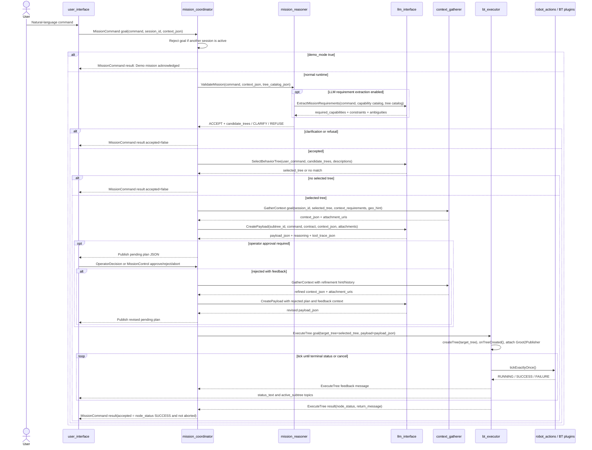

# Generalist BT Gen Architecture

This document describes the implementation currently present in the repository. It
separates implemented runtime behavior from planned extension points so that the
mission flow is not confused with future tree-regeneration work.

## Overview

`generalist_bt_gen` is a ROS 2 Jazzy stack for running natural-language robot
missions through a mission coordinator, a deterministic mission reasoner, an LLM
payload layer, a context-gathering node, and a BehaviorTree.ROS2 executor.

The implemented flow is:

1. A user submits a command through the CLI or web UI.
2. `mission_coordinator` accepts a `MissionCommand` action goal.
3. `mission_coordinator` asks `mission_reasoner` to validate the command against
   the robot system description and BT catalogue capabilities. When enabled,
   `mission_reasoner` first asks `llm_interface` to extract structured mission
   requirements, then applies deterministic validation to those requirements.
4. If the mission is accepted, `mission_coordinator` asks `llm_interface` to
   choose one compatible known behavior tree.
5. `mission_coordinator` asks `context_gatherer` for the context required by that
   tree.
6. `mission_coordinator` asks `llm_interface` to turn that context into a
   blackboard payload.
7. If operator approval is required, the pending plan is published and the
   coordinator waits for approval, rejection, or abort.
8. After approval, `mission_coordinator` sends an `ExecuteTree` goal to
   `bt_executor`.
9. `bt_executor` creates and ticks the selected BehaviorTree.CPP tree, loads the
   JSON payload into the blackboard, and returns the final BT node status.

If the reasoner returns a clarification question or refusal, the mission ends
before BT selection, context gathering, payload generation, or execution.

The executor does not currently synthesize, merge, reload, or regenerate behavior
trees after failures. `PlanSubtree.srv` exists and `llm_interface` serves it, but
the current mission coordinator runtime does not call it.

## Runtime Components

| Package | Implemented responsibility | Important interfaces |
| --- | --- | --- |
| `generalist_bringup` | Launches the integrated stack: `bt_executor`, `llm_interface` unless demo mode is enabled, `context_gatherer`, map helper nodes, `mission_coordinator`, one UI, and a dummy temperature service node. | `launch/generalist_bringup.launch.py`, `config/bt_executor_params.yaml` |
| `user_interface` | Provides CLI and FastAPI/uvicorn web UIs. Both use `MissionGateway` to send mission goals to `mission_coordinator`, query mission state, send approve/reject/abort commands, subscribe to status topics, and display pending plan previews. The UI does not call `bt_executor` directly. | `MissionCommand.action`, `GetMissionState.srv`, `MissionControl.srv`, `OperatorDecision.srv`, `/mission_coordinator/status_text`, `/mission_coordinator/active_subtree`, `/mission_coordinator/pending_plan` |
| `mission_coordinator` | Owns the runtime orchestration. It exposes `/mission_coordinator/execute_tree`, tracks one active mission session, selects a tree, gathers context, builds a payload, waits for optional operator approval, supports payload refinement after rejection, dispatches to `bt_executor`, and maps the BT result into a mission result. | Action server: `/mission_coordinator/execute_tree`. Clients: `/llm_interface/select_behavior_tree`, `/context_gatherer/gather`, `/llm_interface/create_payload`, `/bt_executor/execute_tree`. Services: `/mission_coordinator/status`, `/mission_coordinator/control`, `/mission_coordinator/operator_decision` plus per-process operator-decision alias. |
| `mission_reasoner` | Validates mission commands before BT selection. It optionally asks `llm_interface` to extract structured requirements, then compares those requirements plus deterministic command rules against the configured system description and BT metadata. It returns accept, clarification, or refusal and can narrow the BT candidate list. | Service: `/mission_reasoner/validate_mission`. Client: `/llm_interface/extract_mission_requirements`. Config: `config/system_description.yaml`, `config/tree_metadata.yaml`. |
| `llm_interface` | Provides LangChain-backed requirement extraction, selection, and payload services. Requirement extraction maps free-form commands into structured capability requirements. Selection chooses from the configured tree catalog. Payload generation maps context plus a subtree contract into blackboard JSON, with optional multimodal image attachments and optional schema normalization. If configured LLM calls fail, selection and payload generation have heuristic fallbacks. | Services: `/llm_interface/extract_mission_requirements`, `/llm_interface/select_behavior_tree`, `/llm_interface/create_payload`, `/llm_interface/plan_subtree`. Providers implemented in code: Gemini, OpenAI, OpenRouter. |
| `context_gatherer` | Serves a `GatherContext` action. It subscribes to robot state and sensor topics, captures requested context keys, saves image/map artifacts under `/tmp/context_gatherer` by default, and returns structured JSON plus attachment URIs. It also calls helper services for annotated SLAM maps, satellite-map annotation/fetching, and FindAnything object-location lookup. | Action server: `/context_gatherer/gather`. Inputs include `/odom`, optional pose covariance, GPS, RGB/depth camera topics, battery state, map topic, and `/language_processor/find_object_locations`. |
| `bt_executor` | Subclasses `BT::TreeExecutionServer`. It loads BT XML and robot action plugins, exposes `/bt_executor/execute_tree`, creates a fresh `BT::Tree` for each action goal, seeds the blackboard from the goal payload, publishes textual status and active tree root name, and returns the final BT result. | Action server: `/bt_executor/execute_tree`. Publishes `/mission_coordinator/status_text` and `/mission_coordinator/active_subtree`. Loads XML from `bt_executor/trees` and plugins from `robot_actions/lib`. |
| `robot_actions` | BehaviorTree.CPP/BehaviorTree.ROS2 plugins used by the XML trees. Current registered nodes include `MoveTo`, `TakePicture`/`TakePhoto`, `GetCurrentPose`, `DistanceTraveled`, `FindObjectLocation`/`FindAnything`, `LogTemperature`, `RestartNode`, and `ParseWaypoints`. | Nav2 `NavigateToPose`, FindAnything object-location service, RGB image and odometry topics, trigger-style ROS services, blackboard ports. |
| `gen_bt_interfaces` | Custom action/service contracts shared by Python and C++ packages. | `MissionCommand`, `GatherContext`, `CreatePayload`, `SelectBehaviorTree`, `PlanSubtree`, `GetMissionState`, `MissionControl`, `OperatorDecision`, and related services. |

There is no implemented `bt_updater` package in the current repository.

## Tree Catalog and Metadata

The mission coordinator selects from a configured catalog, not by scanning all XML
files at runtime. The configured catalog is first filtered by `mission_reasoner`
using static capability metadata.

`config/tree_metadata.yaml` contains metadata for `temperature_logging.xml`,
`navigate_and_photograph.xml`, and `explore_area.xml`. Only
`temperature_logging.xml` is present in `src/bt_executor/trees`; the others are
catalogue-level future trees.

The coordinator reads metadata to decide:

- `mission_intents` and `required_capabilities`: passed to `mission_reasoner`.
- `context_requirements`: passed to `context_gatherer`.
- `blackboard_contract`: passed to `llm_interface/create_payload`.

## Implemented Behavior Tree

`src/bt_executor/trees/temperature_logging.xml` is the executable tree currently
used by the default stack:

```text
BehaviorTree ID="temperature_logging.xml"
  Sequence name="TemperatureLoggingMission"
    ParseWaypoints raw_waypoints="{waypoints}"
    LoopString queue="{waypoint_queue}" value="{active_waypoint}" if_empty="SUCCESS"
      Sequence name="VisitWaypoint"
        MoveTo pose="{active_waypoint}" action_name="/a200_0000/navigate_to_pose"
        LogTemperature logfile_path="{logfile_path}"
```

The tree expects a `waypoints` payload field formatted as semicolon-separated
`x,y,yaw` waypoints. `GeneralistBehaviorTreeServer::onTreeCreated` also sets:

- `user_command` to the raw `ExecuteTree.Goal.payload` string.
- `logfile_path` to `/tmp/mission_temp_log.txt` before loading payload values.
- `waypoints_raw` to an empty string.
- each top-level and nested JSON payload value into the BT blackboard.

If the payload contains a `waypoints` field, it is also explicitly written to the
`waypoints` blackboard key as either the string value or serialized JSON.

## Runtime Flow


```mermaid
sequenceDiagram
    actor User
    participant UI as user_interface
    participant MC as mission_coordinator
    participant R as mission_reasoner
    participant LLM as llm_interface
    participant Ctx as context_gatherer
    participant Exec as bt_executor
    participant BT as robot_actions / BT plugins

    User->>UI: Natural-language command
    UI->>MC: MissionCommand goal(command, session_id, context_json)
    MC->>MC: Reject goal if another session is active

    alt demo_mode true
      MC-->>UI: MissionCommand result: Demo mission acknowledged
    else normal runtime
      MC->>R: ValidateMission(command, context_json, tree_catalog_json)
      opt LLM requirement extraction enabled
        R->>LLM: ExtractMissionRequirements(command, capability catalog, tree catalog)
        LLM-->>R: required_capabilities + constraints + ambiguities
      end
      R-->>MC: ACCEPT + candidate_trees / CLARIFY / REFUSE

      alt clarification or refusal
        MC-->>UI: MissionCommand result accepted=false
      else accepted
      MC->>LLM: SelectBehaviorTree(user_command, candidate_trees, descriptions)
      LLM-->>MC: selected_tree or no match

      alt no selected tree
        MC-->>UI: MissionCommand result accepted=false
      else selected tree
        MC->>Ctx: GatherContext goal(session_id, selected_tree, context_requirements, geo_hint)
        Ctx-->>MC: context_json + attachment_uris
        MC->>LLM: CreatePayload(subtree_id, command, contract, context_json, attachments)
        LLM-->>MC: payload_json + reasoning + tool_trace_json

        opt operator approval required
          MC-->>UI: Publish pending plan JSON
          UI->>MC: OperatorDecision or MissionControl approve/reject/abort
          alt rejected with feedback
            MC->>Ctx: GatherContext with refinement hint/history
            Ctx-->>MC: refined context_json + attachment_uris
            MC->>LLM: CreatePayload with rejected plan and feedback context
            LLM-->>MC: revised payload_json
            MC-->>UI: Publish revised pending plan
          end
        end

        MC->>Exec: ExecuteTree goal(target_tree=selected_tree, payload=payload_json)
        Exec->>Exec: createTree(target_tree), onTreeCreated(), attach Groot2Publisher
        loop tick until terminal status or cancel
          Exec->>BT: tickExactlyOnce()
          BT-->>Exec: RUNNING / SUCCESS / FAILURE
          Exec-->>MC: ExecuteTree feedback message
          Exec-->>UI: status_text and active_subtree topics
        end
        Exec-->>MC: ExecuteTree result(node_status, return_message)
        MC-->>UI: MissionCommand result(accepted = node_status SUCCESS and not aborted)
      end
      end
    end
```

Important runtime details:

- `mission_coordinator` handles one active mission at a time.
- `mission_reasoner` is a hard pre-selection gate. When enabled, an unavailable
  reasoner service causes the coordinator to fail closed.
- Operator approval is enabled by default. UI clients can bypass it per goal by
  setting `auto_execute=true` in the goal context JSON.
- A rejected plan with feedback does not change the BT XML. It causes another
  context gather and payload-generation pass for the same selected tree.
- Abort during BT execution calls `cancel_goal_async()` on the active
  `ExecuteTree` goal.
- On BT `FAILURE`, `bt_executor` aborts the `ExecuteTree` action result and
  publishes "Mission failed. Awaiting mission coordinator instructions." It does
  not invoke an LLM, update XML, or restart itself.
- The active-subtree topic is used inconsistently by design today: the mission
  coordinator publishes high-level phases or selected tree IDs, while
  `bt_executor` publishes the root node name of the running BT.

## LLM Behavior

`llm_interface` currently implements four services:

- `ExtractMissionRequirements`: converts the free-form mission command into
  structured capability requirements, mission intents, constraints, and
  ambiguities for `mission_reasoner`. The reasoner remains the final
  deterministic gate.
- `SelectBehaviorTree`: chooses one tree from the supplied catalog. It calls the
  configured LangChain provider when enabled and falls back to the first tree if
  the model is unavailable or returns an invalid choice.
- `CreatePayload`: builds blackboard JSON from context, tree contract, operator
  feedback, prior rejected payloads, and optional image attachments. It can coerce
  waypoint variants into the `waypoints` string contract and optionally ask a
  normalizer model to repair schema mismatches.
- `PlanSubtree`: returns a templated default BT XML string. This is a stub and is
  not wired into the current mission execution path.

Implemented provider adapters are Gemini, OpenAI, and OpenRouter. The current
configuration uses OpenRouter for selection, payload generation, and payload
normalization. There is no Anthropic Claude adapter and no MCP tool execution in
the current implementation, though `tool_trace_json` fields and planning notes
leave room for that later.

## Context Gathering

`context_gatherer` accepts requirement strings and maps them to handlers. Current
implemented requirements include:

- `ROBOT_POSE`
- `RGB_IMAGE`
- `DEPTH_IMAGE`
- `BATTERY_STATE`
- `GPS_FIX`
- `ANNOTATED_SLAM_MAP_IMAGE`
- `SATELLITE_MAP` and `SATELLITE_TILE`
- `FIND_ANYTHING`

Unknown requirement strings are logged and skipped. The action result can still
succeed with whatever context was collected.

## Configuration and Observability

- BehaviorTree.ROS2 parameters configure the executor action name, tick frequency,
  Groot2 port, BT XML directories, and plugin directories.
- `bt_executor` custom parameters configure plugin discovery, Nav2/service names,
  status topics, debug logging, and failure handling.
- `mission_coordinator` parameters configure the mission action, services,
  context gather action, BT executor action, timeouts, tree metadata file, demo
  mode, and known tree catalog.
- `llm_interface` parameters configure provider/model names, prompts, multimodal
  payload settings, and schema normalization.
- CLI and web UIs write JSONL transcripts under `~/.generalist_bt/chat_logs`.
- `context_gatherer` writes artifacts under `/tmp/context_gatherer` by default.
- BehaviorTree.ROS2 creates a Groot2 publisher for each created tree on the
  configured port.
- `mission_reasoner` reads the static system description from
  `config/system_description.yaml` and can use
  `/llm_interface/extract_mission_requirements` as a semantic parser.

Some declared parameters are reserved or only partially wired today, including
`llm_plan_service`, `context_snapshot_service`, `enable_context_snapshot`,
`payload_timeout_sec`, `bt_timeout_sec`, `transcript_directory`, and
`feedback_rate_hz`.

## Planned or Partially Implemented Extension Points

These are present as interfaces, metadata, or plan documents, but not as a
working runtime loop:

- Runtime BT regeneration after a failed execution.
- A `bt_updater` package that merges generated XML into canonical trees.
- Calling `PlanSubtree.srv` from `mission_coordinator`.
- Chaining multiple selected subtrees for one user mission.
- Executing newly generated XML without restarting or relaunching.
- MCP-backed tool traces for LLM planning and payload generation.
- Additional XML trees referenced by metadata, such as `navigate_and_photograph.xml`
  and `explore_area.xml`.
