# BehaviorTree.ROS2 + LangChain Architecture

## Overview

`generalist_bt_gen` combines ROS 2 Jazzy, BehaviorTree.CPP, BehaviorTree.ROS2, and LangChain to let a field robot execute natural-language tasks and expand its own behavior tree when it detects capability gaps. The executor now subclasses `behaviortree_ros2::TreeExecutionServer`, so BT runs are exposed as ROS 2 Actions with built-in logging, preemption, and plugin management. When the tree cannot complete a command, LangChain orchestrates LLM reasoning, tool calls, and MCP servers to synthesize new BT subtrees that are merged into the running executor without restarting the rest of the stack.

> **Note:** “Expanding the tree” does **not** mean mutating a running `BT::Tree` instance. Instead, the `TreeExecutionServer` node stays alive, but the internal `BT::Tree` is stopped, updated XML is computed, and a **new** tree is created from that XML inside the same executor process. From the ROS 2 Action perspective, this may mean that the **current goal is finished** (e.g., with a special result code) and a **follow-up goal** is started once regeneration completes.

## Orchestration Layer (LLM Pre‑Hook)

To keep the behavior tree focused on **execution** and move “Thinking” / planning outside, the architecture uses an explicit orchestration layer between the user and `bt_executor`:

- The **chat_interface** is a **pure UI layer**: it displays information to the user and forwards high-level commands to the orchestrator.
- A separate **orchestrator node** implements the **logic layer**:
  - Receives user commands from the UI.
  - Calls `llm_interface` as a pre‑hook to interpret the command and design a plan over available BT subtrees.
  - Optionally synthesizes or updates subtrees via `bt_updater` / `llm_interface` before any BT run.
  - Sends `ExecuteTree` goals to `bt_executor` (execution layer) and monitors feedback.
  - Uses BT feedback, additional sensor/context information, and possibly LLM guidance to decide when to:
    - Chain another subtree,
    - Halt the current behavior tree,
    - Trigger regeneration, or
    - Ask the user for confirmation (e.g., “exploration seems complete, stop here?”).

This means:

- The “Thinking node” can live entirely **outside** the BT as a pre‑hook inside the orchestrator.
- The BT XML hosted by `bt_executor` is a collection of **reusable subtrees** and glue logic, not a monolithic “do everything” tree.
- The regeneration logic and decisions about which subtree to execute are expressed in **normal ROS 2 node code** in the orchestrator, which can also implement higher-level stopping criteria for open-ended missions (like exploration).

## Technology Stack

| Layer | Tooling | Notes |
| --- | --- | --- |
| Behavior tree runtime | BehaviorTree.CPP 4.x | Core BT engine and plugin API. |
| ROS integration | BehaviorTree.ROS2 (`TreeExecutionServer`) | Wraps BT execution inside an `rclcpp_action::Server`, handles XML/plugin discovery, Groot2 logging, and action feedback. |
| Robotics middleware | ROS 2 Jazzy | Provides rclcpp/rclpy nodes, services, actions, Nav2 + sensor interfaces. |
| LLM orchestration | LangChain (Python) | Supplies prompt templates, multi-provider LLM clients (OpenAI/Gemini/Claude), tool-calling, and MCP server integration for structured plans and BT specs. |
| Cloud LLMs | OpenAI, Google Gemini, Anthropic Claude | Configurable via LangChain; selected per prompt config. |

## Package Responsibilities

| Package | Purpose | Key Dependencies |
| --- | --- | --- |
| `bt_executor` | Extends `TreeExecutionServer` with custom hooks: registers BT plugins once, seeds the global blackboard, listens for failure states, and drives the LLM regeneration loop. On regeneration, it stops the current BT run and calls `createTreeFromText` with updated XML, without restarting the ROS 2 Action server or node. The current action goal is completed with an explicit result (e.g., `NEEDS_EXTENSION` or `TREE_UPDATED`), and the orchestrator is expected to re-issue or continue the mission via a follow-up goal. Publishes action feedback/metrics. | `behaviortree_cpp`, `behaviortree_ros2`, `rclcpp`, `std_srvs`, `yaml-cpp`, `nlohmann_json`. |
| `robot_actions` | ROS-native BT plugins for locomotion, manipulation, and sensing (Nav2 goals, camera triggers, etc.). | `rclcpp`, `behaviortree_cpp`, `nav2_msgs`, `sensor_msgs`, `geometry_msgs`, `action_msgs`. |
| `llm_actions` | BT nodes that gate behavior based on LLM output, update the blackboard, and bridge to the LangChain service (e.g., Thinking node, plan validator). These are optional if the project decides to keep all “Thinking” in the external orchestration layer and use the BT purely for execution. | `rclcpp`, `behaviortree_cpp`, `nlohmann_json`, `llm_interface`. |
| `context_gatherer` | Aggregates camera frames, GPS, point clouds, and semantic context into the format expected by LangChain tools/MPL servers. | `rclcpp`, `sensor_msgs`, `nav_msgs`, `geographic_msgs`, `image_transport`, `cv_bridge`, `nlohmann_json`. |
| `llm_interface` | Python ROS node exposing `LLMQuery.srv`. Uses LangChain PromptTemplates, tool chains, and MCP-backed retrievers to generate BT specs + artifacts. It is called both as a **pre‑hook** before BT execution (to choose/churn subtrees) and during regeneration when new capabilities are needed. | `rclpy`, `langchain`, `openai`, `google-generativeai`, `anthropic`, `requests`, `python3-yaml`. |
| `bt_updater` | Applies LangChain-generated XML patches to the authoritative BT tree, validates them with TinyXML2, and returns merged XML to the executor, which then recreates the internal `BT::Tree`. | `rclcpp`, `behaviortree_cpp`, `tinyxml2`, `yaml-cpp`. |
| `orchestrator` | Logic layer between UI and BT execution. Receives commands from `chat_interface`, calls `llm_interface` to interpret them, plans over available subtrees, triggers `bt_updater` when new subtrees are needed, sends `ExecuteTree` goals to `bt_executor`, monitors feedback, and decides when to chain further subtrees, halt execution, or ask the user for confirmation (e.g., when open-ended goals like “explore the area” appear sufficiently satisfied). | `rclpy`/`rclcpp`, `action_msgs`, `llm_interface`, `bt_updater`, `context_gatherer`. |
| `chat_interface` | Pure UI layer for human commands and status; acts as a client of the `orchestrator` (via ROS 2 or HTTP/WebSocket). Displays progress, questions (e.g., “stop exploration now?”), and final results but does not directly talk to `bt_executor`. | `rclpy`, `FastAPI`/`Flask`, `websockets`. |

Optional packages such as `bt_visualizer` can subscribe to the executor action feedback or Groot2 stream for live dashboards.

## Main Tree Structure

```markdown
// filepath: /home/luke/generalist_bt_gen/architecture.md
ReactiveSequence:
    - ChatInterfaceAbortSignalConditionCheck
    - Thinking Action Node (outputs decision enum)
    - Fallback:
        - Subtrees to execute (preconditioned with skipIf: decision != subtree_enum)
        - FailureFallbackAction (triggers tree-expansion as no subtree was executed or they failed while running)
```

> **Variant:** In the “Thinking outside BT” design, the above root may be simplified to a **pure execution tree** (e.g., a `Sequence`/`Fallback` over robot skills and guards), while the LLM “Thinking Action Node” and `FailureFallbackAction` logic move into the orchestration layer. The BT then executes a specific subtree ID or entry point chosen by the LLM pre‑hook.

## Runtime Flow

```mermaid
sequenceDiagram
    actor User
    participant UI as chat_interface (UI Layer)
    participant Orc as orchestrator (Logic Layer)
    participant Exec as bt_executor (TreeExecutionServer, Execution Layer)
    participant Skills as robot_actions / llm_actions
    participant Ctx as context_gatherer
    participant LLM as llm_interface (LangChain)
    participant Upd as bt_updater

    User->>UI: "Explore the field and photograph lonely trees"
    UI->>Orc: sendCommand(command)

    Note over Orc,LLM: Pre-hook "Thinking" in the orchestrator
    Orc->>LLM: LLMQuery.srv(command, available_subtrees, recent_results)
    LLM-->>Orc: plan = { subtree_ids[], maybe_new_subtree_spec }

    alt new subtree needed
      Orc->>Upd: UpdateTree.srv(plan.new_subtree_xml)
      Upd-->>Orc: OK + merged XML path
      Orc->>Exec: Notify/trigger reload (if needed)
    end

    loop for subtree in plan.subtree_ids
      Orc->>Exec: Send `ExecuteTree` goal (subtree_id, command context)
      Exec->>Skills: Tick BT via TreeExecutionServer loop
      Skills-->>Exec: RUNNING / SUCCESS / FAILURE
      Exec-->>Orc: Action feedback (node status, tick count, telemetry)
      Orc-->>UI: Forward progress / status updates

      alt subtree SUCCESS
        Orc-->>Orc: Decide whether to call next subtree or ask user
      else subtree FAILURE or NEEDS_EXTENSION
        Exec-->>Orc: Action result (status + failure_reason)
        Orc->>Ctx: Optional snapshot for context
        Ctx-->>Orc: Context JSON
        Orc->>LLM: Optional LLMQuery.srv(command, failure_reason, context)
        LLM-->>Orc: updated plan / new subtree request
        Orc-->>UI: Inform user, optionally ask for confirmation
      end
    end

    Note over Orc,UI: For open-ended goals (e.g., exploration), Orc may stop when coverage/time thresholds are met, ask LLM for a “good enough” judgement, and then ask the user: "Exploration appears complete, stop here?"
```



## Failure & Regeneration Lifecycle

1. **Detection (inside BT)** – `TreeExecutionServer::onLoopAfterTick` still inspects every tick result. When the BT returns `FAILURE` or a guard node signals `NEEDS_EXTENSION`, the hook stops the current action goal and enters regeneration mode. The `TreeExecutionServer` node and Action server remain active; the goal finishes with a differentiable status/result that the orchestrator understands.
2. **Decision (outside BT)** – The **orchestration layer** (typically `chat_interface`) receives the Action result and decides whether to:
   - Simply report failure to the user, or
   - Invoke the LLM again to repair or extend capabilities.
3. **Context capture** – The orchestrator can request a snapshot from `context_gatherer` via ROS service. Output is saved and passed as structured JSON to LangChain.
4. **LangChain workflow** – `llm_interface` loads the configured PromptTemplate, selects a model (OpenAI/Gemini/Claude) and orchestrates tool calls (e.g., map query, knowledge base). The final response contains a validated BT spec plus supporting artifacts (new plugin hints, metadata).
5. **Tree update** – `bt_updater` merges the generated subtree into the canonical XML, leveraging TinyXML2 + schema validation. Conflicts are resolved via predefined anchors (e.g., `LearningSelector` insertion point). The merged XML is returned to the orchestrator and/or `bt_executor`.
6. **Executor reload** – `bt_executor` calls `TreeExecutionServer::createTreeFromText` with the merged XML, reattaches loggers, repopulates or reuses the blackboard, and waits for the next Action goal. The orchestrator then sends a **new** `ExecuteTree` goal (for the same mission or the next step in the plan), so the robot continues with an updated set of subtrees.

## Configuration & Observability

- **Parameters**: BehaviorTree.ROS2 parameters set plugin folders, XML search paths, executor QoS, and action names. Additional YAML files define LangChain prompt configs, tool endpoints, and MCP server credentials.
- **Secrets**: Cloud API keys (OpenAI, Gemini, Claude) live in `llm_interface` environment files; the setup script provisions them via `.cloud_secrets/openai.env`.
- **Monitoring**: Groot2 is enabled by default via `TreeExecutionServer`. `bt_executor` can attach extra publishers that mirror action feedback to `diagnostics` topics for Prometheus dashboards. LangChain reasoning traces are logged to JSONL for auditing.
- **Testing hooks**: BehaviorTree.ROS2’s headless tools allow dry-run execution of XML trees. LangChain pipelines are unit-tested with mock LLMs and tool call fixtures.

This revised architecture keeps the modular ROS 2 package layout while delegating BT execution concerns to BehaviorTree.ROS2, while making the **LLM planning and regeneration logic an explicit orchestration layer outside the BT**, which can chain subtrees and trigger updates before or between BT runs.
