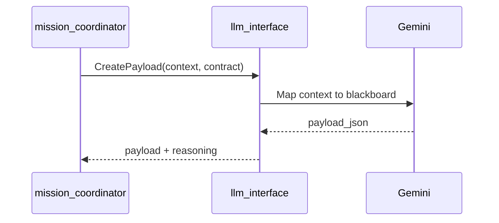
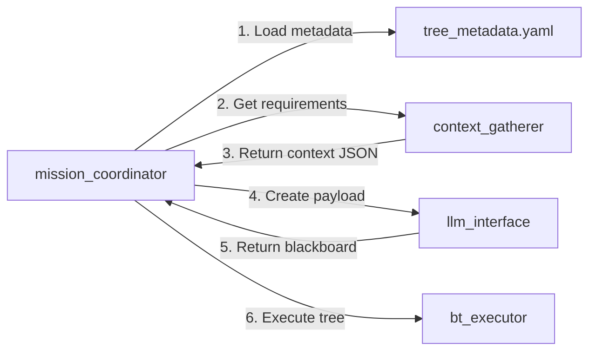

# Implementation Walkthrough: ROS Interface Enhancements

This walkthrough documents the completion of three major tasks to enhance the `generalist_bt_gen` project's ROS interface layer.

---

## Task 3: CreatePayload Service ✅

### What Was Implemented

Added the `CreatePayload` service to `llm_interface` to transform raw sensor context into structured blackboard payloads for behavior trees.

### Key Changes

#### [llm_interface/node.py](file:///home/luke/generalist_bt_gen/src/llm_interface/llm_interface/node.py)

- **Service Handler**: `handle_create_payload()` processes requests with context and contract JSON
- **LLM Generation**: `_generate_payload_via_llm()` uses LangChain to intelligently map context to blackboard entries
- **Fallback Logic**: `_fallback_payload()` provides heuristic mapping when LLM is unavailable
- **Prompt Template**: Instructs LLM to map sensor data to BT parameters based on contract schema

### How It Works



**Example**:
- **Input Context**: `{"ROBOT_POSE": {"x": 1.0, "y": 2.0}}`
- **Input Contract**: `{"target_pose": {"type": "Pose", "required": true}}`
- **Output Payload**: `{"target_pose": {"x": 1.0, "y": 2.0, "theta": 0.0}}`

---

## Task 2: Tree Metadata Schema ✅

### What Was Implemented

Created a YAML-based metadata system to define context requirements and blackboard contracts for each behavior tree.

### Key Files

#### [config/tree_metadata.yaml](file:///home/luke/generalist_bt_gen/config/tree_metadata.yaml)

Defines metadata for trees:

```yaml
trees:
  - id: "demo_tree.xml"
    description: "Simple demo tree"
    context_requirements:
      - ROBOT_POSE
    blackboard_contract:
      test_message:
        type: "string"
        default: "Hello from demo tree"
```

#### [mission_coordinator/node.py](file:///home/luke/generalist_bt_gen/src/mission_coordinator/mission_coordinator/node.py)

- **YAML Loader**: `_load_tree_metadata()` parses metadata file at startup
- **Context Lookup**: `_context_requirements_for_tree()` returns requirements list
- **Contract Lookup**: `_subtree_contract_for_tree()` returns contract as JSON

### Benefits

1. **Declarative Configuration**: Tree requirements defined in YAML, not hardcoded
2. **Type Safety**: Contracts specify expected blackboard key types
3. **Defaults**: Fallback values when context is missing
4. **Extensibility**: Easy to add new trees without code changes

---

## Task 1: Real Sensor Integration ✅

### What Was Implemented

Transformed `context_gatherer` from a stub into a real sensor aggregation node with ROS topic subscribers and file I/O.

### Key Changes

#### [context_gatherer/src/context_gatherer_node.cpp](file:///home/luke/generalist_bt_gen/src/context_gatherer/src/context_gatherer_node.cpp)

**Sensor Subscribers**:
- `/odom` → `latest_odom_` (nav_msgs/Odometry)
- `/camera/image_raw` → `latest_rgb_` (sensor_msgs/Image)
- `/camera/depth/image_raw` → `latest_depth_` (sensor_msgs/Image)
- `/battery_state` → `latest_battery_` (sensor_msgs/BatteryState)

**Requirement Handlers** (Strategy Pattern):
```cpp
requirement_handlers_["ROBOT_POSE"] = [this](json& ctx, vector<string>& uris) {
  handle_robot_pose(ctx);
};
```

**Image Saving**:
- Uses `cv_bridge` to convert ROS images to OpenCV
- Saves to disk with timestamped filenames
- Returns `file://` URIs in `attachment_uris`

**JSON Output** (using nlohmann::json):
```json
{
  "ROBOT_POSE": {
    "x": 1.23,
    "y": 4.56,
    "orientation": {"x": 0, "y": 0, "z": 0, "w": 1}
  },
  "RGB_IMAGE": {
    "uri": "file:///tmp/context_gatherer/rgb_1234567890_123456789.png",
    "width": 640,
    "height": 480
  }
}
```

#### [context_gatherer/CMakeLists.txt](file:///home/luke/generalist_bt_gen/src/context_gatherer/CMakeLists.txt)

Added dependencies:
- `cv_bridge` - ROS/OpenCV conversion
- `OpenCV` - Image I/O
- `nlohmann_json` - JSON serialization

---

## Integration Flow

The three components work together:



1. **Mission coordinator** loads tree metadata to know what context is needed
2. **Context gatherer** subscribes to sensors and builds JSON snapshot
3. **LLM interface** transforms context into blackboard payload
4. **BT executor** receives payload and runs the tree

---

## Testing

### Manual Verification

1. **Build the workspace**:
```bash
cd /home/luke/generalist_bt_gen
colcon build --packages-select context_gatherer llm_interface mission_coordinator
```

2. **Run context_gatherer**:
```bash
ros2 run context_gatherer context_gatherer_node
```

3. **Publish mock sensor data**:
```bash
ros2 topic pub /odom nav_msgs/msg/Odometry "{...}"
```

4. **Call GatherContext**:
```bash
ros2 action send_goal /context_gatherer/gather gen_bt_interfaces/action/GatherContext \
  "{session_id: 'test', context_requirements: ['ROBOT_POSE', 'RGB_IMAGE']}"
```

5. **Verify output**:
   - Check `context_json` contains real pose data
   - Check `attachment_uris` has image file path
   - Verify image exists on disk

---

## Next Steps

With these foundations in place, the project is ready for:

1. **v1.0 Milestone**: Full integration testing in simulation (Gazebo)
2. **Robot Actions**: Implement real BT plugins (NavigateToPose, TakePicture)
3. **End-to-End Flow**: Test complete mission from UI → LLM → BT → Robot
4. **v2.0 (Self-Repair)**: Implement `bt_updater` for tree regeneration
